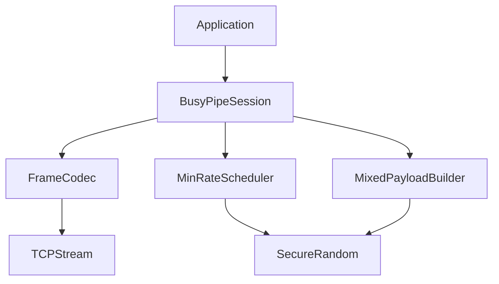
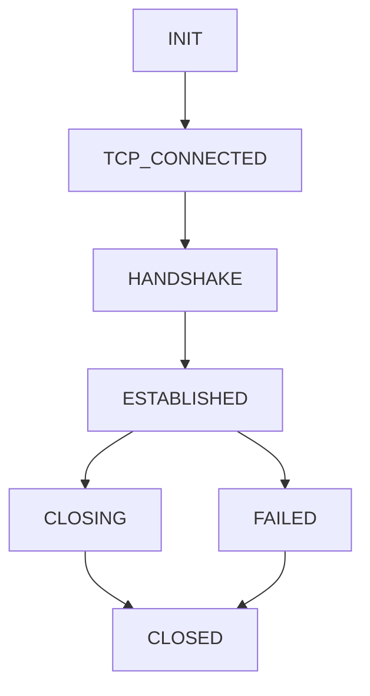

# BusyPipe Protocol

BusyPipe 是一个运行在 TCP 之上的应用层通信协议。它的核心目标是在非稳定网络中维持持续、可观测的连接活跃度：即使没有真实业务数据，也保持最低 `8kbps` 的单向发送流量；当存在真实数据时，将真实数据混入随机填充数据中，并让真实数据在包内的位置发生随机抖动。

本文档定义 BusyPipe 的协议格式、流量调度、数据混合策略，以及 Python 版本 client/server 的推荐实现方式。

## 设计目标

- 基于 TCP 实现可靠、有序传输。
- 每个启用方向最低保持 `8kbps` 通信流量。
- 无业务数据时持续发送随机填充数据。
- 有业务数据时优先使用混合帧，将真实数据包裹在随机数据之间。
- 真实数据在混合帧中的位置随机变化，相邻真实数据帧的偏移差至少 `8 byte`。
- 接收端能够稳定解析真实数据，并丢弃随机填充。
- Python client 和 server 使用同一套帧编解码、调度和状态机。

默认定义：

- `8kbps = 8000 bit/s = 1000 byte/s`
- 最低流量按单向发送计算。
- client 和 server 默认都启用最低发送流量，即双向各自维持 `8kbps`。

## 协议分层



## 连接生命周期

1. TCP 建连。
2. 双方交换 `HELLO` 帧，协商协议参数。
3. 进入 `ESTABLISHED` 状态。
4. 发送端持续运行最低流量调度器。
5. 接收端持续解析帧，刷新活跃时间。
6. 超时、协议错误或网络错误时关闭连接。
7. client 可按指数退避策略重连。

状态机：



## 握手参数

双方建立 TCP 连接后，必须先交换 `HELLO` 帧。只有双方都接受参数后，连接才进入 `ESTABLISHED`。

建议参数：

| 参数 | 默认值 | 说明 |
| --- | --- | --- |
| `version` | `1` | 协议版本 |
| `min_bps` | `8000` | 最低单向发送速率 |
| `tick_ms` | `250` | 发送调度周期 |
| `max_frame_size` | `1400` | 单帧最大字节数 |
| `idle_timeout_ms` | `15000` | 接收空闲超时 |
| `min_jitter_bytes` | `8` | 相邻真实数据偏移的最小变化 |
| `direction` | `bidirectional` | 保活方向 |

`HELLO` payload 使用 UTF-8 JSON 编码：

```json
{
  "version": 1,
  "min_bps": 8000,
  "tick_ms": 250,
  "max_frame_size": 1400,
  "idle_timeout_ms": 15000,
  "min_jitter_bytes": 8,
  "direction": "bidirectional"
}
```

协商规则：

- `version` 不兼容时关闭连接。
- `min_bps` 取双方支持范围内的值，默认不低于 `8000`。
- `max_frame_size` 取双方较小值。
- `tick_ms` 取双方较大值，避免过于频繁地发送小包。
- `idle_timeout_ms` 取双方较小值。
- `min_jitter_bytes` 取双方较大值。

## 帧格式

BusyPipe 使用二进制帧。所有业务数据、随机填充、控制消息都必须封装为帧。

基础帧头固定为 `16 byte`：

```text
0                   1                   2                   3
+-------------------+-------------------+-------------------+-------------------+
| Magic(2)          | Version(1)        | Type(1)                               |
+-------------------+-------------------+-------------------+-------------------+
| Flags(1)          | HeaderLen(1)      | Length(2)                             |
+-------------------+-------------------+-------------------+-------------------+
| Seq(4)                                                                        |
+-------------------------------------------------------------------------------+
| HeaderCrc(4)                                                                  |
+-------------------------------------------------------------------------------+
| Payload ...                                                                   |
+-------------------------------------------------------------------------------+
```

字段说明：

| 字段 | 长度 | 说明 |
| --- | ---: | --- |
| `Magic` | 2 | 固定为 `0x4250`，ASCII 含义为 `BP` |
| `Version` | 1 | 当前为 `1` |
| `Type` | 1 | 帧类型 |
| `Flags` | 1 | 标志位，初始为 `0` |
| `HeaderLen` | 1 | 帧头长度，当前为 `16` |
| `Length` | 2 | payload 长度 |
| `Seq` | 4 | 单向递增序号 |
| `HeaderCrc` | 4 | 帧头校验，计算时该字段视为 `0` |
| `Payload` | N | 帧内容 |

字节序统一使用 network byte order，也就是 big-endian。

`Length` 只表示 payload 长度，不包含帧头。完整帧长度为：

```text
frame_size = HeaderLen + Length
```

`frame_size` 不得超过协商出的 `max_frame_size`。

## 帧类型

| Type | 名称 | 说明 |
| ---: | --- | --- |
| `0x01` | `HELLO` | 参数协商 |
| `0x02` | `DATA` | 纯业务数据，通常只在无法混合时使用 |
| `0x03` | `PAD` | 随机填充，接收后丢弃 |
| `0x04` | `PING` | 显式探测 |
| `0x05` | `PONG` | 探测响应 |
| `0x06` | `CLOSE` | 优雅关闭 |
| `0x07` | `MIXED` | 随机填充和真实数据混合 |

## MIXED 帧

`MIXED` 是 BusyPipe 的推荐业务承载格式。它将真实数据放在随机填充中间，并随机改变真实数据在 payload 内的位置。

`MIXED` payload 结构：

```text
0                   1                   2                   3
+-------------------+-------------------+-------------------+-------------------+
| DataOffset(2)     | DataLength(2)                                         |
+-------------------------------------------------------------------------------+
| PadNonce(4)                                                                   |
+-------------------------------------------------------------------------------+
| RandomPrefix ...                                                              |
+-------------------------------------------------------------------------------+
| RealData ...                                                                  |
+-------------------------------------------------------------------------------+
| RandomSuffix ...                                                              |
+-------------------------------------------------------------------------------+
```

字段说明：

| 字段 | 长度 | 说明 |
| --- | ---: | --- |
| `DataOffset` | 2 | 从 payload 起点到真实数据起点的偏移 |
| `DataLength` | 2 | 真实数据长度 |
| `PadNonce` | 4 | 随机数，用于增加同长度 payload 的差异 |
| `RandomPrefix` | 可变 | 真实数据前的随机填充 |
| `RealData` | 可变 | 真实业务数据 |
| `RandomSuffix` | 可变 | 真实数据后的随机填充 |

`MIXED` 约束：

- `DataOffset >= 8`，因为 `DataOffset + DataLength + PadNonce` 共占 `8 byte`。
- `DataOffset + DataLength <= Length`。
- `DataLength > 0`。
- `RandomPrefix` 和 `RandomSuffix` 必须使用安全随机源生成。
- 相邻两个承载真实数据的 `MIXED` 帧，`DataOffset` 的差值至少为 `min_jitter_bytes`，默认 `8 byte`。

偏移示意：

```text
Payload start
|
v
+----------+----------------+-------------+----------------+
| Metadata | RandomPrefix   | RealData    | RandomSuffix   |
+----------+----------------+-------------+----------------+
           ^
           |
       DataOffset
```

发送端选择 `DataOffset` 的算法：

```python
def choose_data_offset(min_offset, max_offset, last_offset, min_jitter):
    if max_offset < min_offset:
        return None

    if last_offset is None:
        return secure_randint(min_offset, max_offset)

    candidates = [
        offset
        for offset in range(min_offset, max_offset + 1)
        if abs(offset - last_offset) >= min_jitter
    ]
    if not candidates:
        return None

    return secure_choice(candidates)
```

如果无法找到满足 `8 byte` 抖动的合法偏移：

1. 优先增大 `MIXED` payload 总长度。
2. 如果业务数据太大，则切片成多个 `MIXED` 帧。
3. 如果仍无法满足，则降级为 `DATA` 帧，并在本地指标中记录一次 `mixed_jitter_fallback`。

## 最低 8kbps 调度

发送端维护一个按 tick 运行的最低速率调度器。

默认值：

- `min_bps = 8000`
- `min_bytes_per_second = 1000`
- `tick_ms = 250`
- `target_bytes_per_tick = 250`

每个 tick 统计本方向已经写入 TCP 的完整帧字节数。若不足目标字节数，则发送 `PAD` 或 `MIXED` 帧补足。

调度规则：

- 业务数据优先级高于随机填充。
- 有业务数据时，优先编码为 `MIXED` 帧。
- `DATA`、`MIXED`、`PAD` 的完整帧长度都计入最低流量。
- 如果一个 tick 内业务数据已经超过目标字节数，不额外发送 `PAD`。
- 如果 TCP 写缓冲存在背压，允许跳过 `PAD`，但不得无限堆积填充帧。

伪代码：

```python
async def scheduler_loop():
    while session.is_established:
        await sleep(tick_ms / 1000)

        deficit = target_bytes_per_tick - bytes_sent_in_tick
        if deficit > 0:
            await send_padding(deficit)

        bytes_sent_in_tick = 0
```

`send_padding(deficit)` 应按完整帧长度补足：

```text
pad_payload_len = max(0, deficit - frame_header_len)
```

如果 `deficit` 小于最小可用帧长度，可以累计到下一个 tick，避免制造过多极小 TCP segment。

## 接收侧行为

接收端持续从 TCP stream 中读取完整 BusyPipe 帧。

处理规则：

- 收到 `HELLO`：在握手阶段解析参数。
- 收到 `DATA`：payload 直接交给业务层。
- 收到 `MIXED`：按 `DataOffset` 和 `DataLength` 提取真实数据，其余随机数据丢弃。
- 收到 `PAD`：丢弃 payload，但刷新活跃时间。
- 收到 `PING`：回复 `PONG`。
- 收到 `PONG`：刷新活跃时间。
- 收到 `CLOSE`：进入关闭流程。

接收端必须校验：

- `Magic` 是否为 `0x4250`。
- `Version` 是否支持。
- `HeaderLen` 是否为已知长度。
- `Length` 是否超过 `max_frame_size - HeaderLen`。
- `HeaderCrc` 是否正确。
- `MIXED` 的 `DataOffset` 和 `DataLength` 是否越界。

协议错误应关闭连接。

## Python 实现结构

推荐使用 Python 3.11+ 和 `asyncio` 实现。

项目结构：

```text
busypipe/
  pyproject.toml
  busypipe/
    __init__.py
    constants.py
    frame.py
    mixed.py
    scheduler.py
    session.py
    client.py
    server.py
  examples/
    client_echo.py
    server_echo.py
  tests/
    test_frame.py
    test_mixed.py
    test_scheduler.py
```

模块职责：

| 模块 | 职责 |
| --- | --- |
| `constants.py` | 协议常量、默认参数、帧类型 |
| `frame.py` | 帧编码、解码、CRC 校验 |
| `mixed.py` | `MIXED` payload 构造和解析 |
| `scheduler.py` | 最低速率调度和 tick 统计 |
| `session.py` | 连接状态机、读写循环、握手 |
| `client.py` | TCP client、重连策略 |
| `server.py` | TCP server、连接接受和会话管理 |

### FrameCodec

`FrameCodec` 负责二进制帧编解码。

建议接口：

```python
class FrameCodec:
    def encode(self, frame_type: int, payload: bytes, flags: int = 0) -> bytes:
        ...

    async def read_frame(self, reader: asyncio.StreamReader) -> Frame:
        ...
```

编码建议使用 `struct.pack`：

```python
HEADER_FORMAT = "!HBBBBHI"
```

其中 CRC 字段可单独追加，或者使用完整格式：

```python
FULL_HEADER_FORMAT = "!HBBBBHII"
```

### MixedPayloadBuilder

`MixedPayloadBuilder` 负责将真实数据嵌入随机填充。

建议接口：

```python
class MixedPayloadBuilder:
    def build(self, data: bytes, target_payload_len: int) -> bytes:
        ...

    def parse(self, payload: bytes) -> bytes:
        ...
```

随机源使用：

```python
import secrets

random_bytes = secrets.token_bytes(size)
offset = secrets.choice(candidates)
```

### BusyPipeSession

`BusyPipeSession` 是 client 和 server 共享的会话抽象。

核心职责：

- 执行 `HELLO` 握手。
- 启动读循环和调度循环。
- 提供 `send(data: bytes)` 发送业务数据。
- 提供 `recv() -> bytes` 接收业务数据。
- 管理连接关闭、超时和错误。

建议接口：

```python
class BusyPipeSession:
    async def start(self) -> None:
        ...

    async def send(self, data: bytes) -> None:
        ...

    async def recv(self) -> bytes:
        ...

    async def close(self) -> None:
        ...
```

### Client

client 负责主动连接 server。

建议接口：

```python
class BusyPipeClient:
    async def connect(self, host: str, port: int) -> BusyPipeSession:
        ...
```

client 可选支持断线重连：

- 初始重连间隔 `1s`。
- 最大重连间隔 `30s`。
- 每次失败后指数退避。
- 成功连接后重置退避。

### Server

server 负责监听 TCP 端口，并为每个连接创建 `BusyPipeSession`。

建议接口：

```python
class BusyPipeServer:
    async def start(self, host: str, port: int) -> None:
        ...

    async def close(self) -> None:
        ...
```

server 对每个连接启动独立 task：

```python
async def handle_connection(reader, writer):
    session = BusyPipeSession(reader, writer, role="server")
    await session.start()
```

## 背压与缓冲

Python `asyncio.StreamWriter` 写入后应调用 `await writer.drain()`，让 TCP 背压生效。

规则：

- 真实业务数据不可静默丢弃。
- `PAD` 可在背压严重时跳过。
- `MIXED` 中的真实数据不可因为补流量失败而丢弃。
- 发送队列应设置最大长度，防止内存无限增长。

推荐队列：

- `data_queue`: 存放真实业务数据。
- `recv_queue`: 存放接收后还原出的真实业务数据。

## 超时与保活

接收侧维护 `last_received_at`。

如果超过 `idle_timeout_ms` 未收到任何完整有效帧：

1. 关闭当前 TCP 连接。
2. client 进入重连流程。
3. server 释放会话资源。

由于 BusyPipe 本身持续发送 `PAD` 或 `MIXED`，通常不需要频繁发送 `PING`。`PING/PONG` 主要用于调试、显式延迟测量或判断应用层是否仍在响应。

## 安全说明

BusyPipe 的随机填充用于保活和降低流量空闲特征，不等于加密。

如果需要保护真实数据内容或隐藏 `MIXED` 元信息，应将 BusyPipe 运行在 TLS 之上，或在帧层增加 AEAD 加密。

建议：

- 公网部署时使用 TLS。
- 不要将 `PAD` 随机性视为安全边界。
- 不要在日志中输出真实 payload。
- 对异常帧只记录类型、长度、连接信息，不记录原始内容。

## 指标与日志

推荐暴露以下指标：

| 指标 | 说明 |
| --- | --- |
| `bytes_sent_total` | 已发送总字节数 |
| `bytes_received_total` | 已接收总字节数 |
| `data_frames_sent_total` | 已发送 DATA 帧数 |
| `mixed_frames_sent_total` | 已发送 MIXED 帧数 |
| `pad_frames_sent_total` | 已发送 PAD 帧数 |
| `mixed_jitter_fallback_total` | 无法满足偏移抖动而降级的次数 |
| `connection_idle_timeout_total` | 空闲超时次数 |
| `protocol_error_total` | 协议错误次数 |

日志级别：

- `INFO`: 建连、断开、参数协商结果。
- `WARNING`: 重连、背压、降级为 `DATA`。
- `ERROR`: 协议错误、CRC 错误、异常关闭。
- `DEBUG`: 帧类型和长度统计，不输出 payload 内容。

## 测试计划

单元测试：

- 帧编码后可被正确解码。
- 非法 `Magic`、非法长度、CRC 错误会被拒绝。
- `MIXED` 能正确提取真实数据。
- 相邻 `MIXED` 帧偏移差至少 `8 byte`。
- 业务数据过大时能切片或降级。
- 调度器在无业务数据时维持约 `1000 byte/s`。

集成测试：

- client/server 可完成握手。
- client 可发送数据到 server。
- server 可发送数据到 client。
- 无业务数据时连接仍持续有 `PAD` 流量。
- 弱网模拟下断线后 client 可重连。

## 兼容性与版本演进

当前版本为 `1`。

未来可扩展方向：

- 帧层 AEAD 加密。
- payload 压缩标志。
- 多路复用 stream id。
- 自适应最低速率。
- 更复杂的长度分布和发送间隔抖动。

版本演进原则：

- 增加可选字段时通过 `HeaderLen` 和 `Flags` 扩展。
- 破坏性变更必须提升 `version`。
- 不支持的 `version` 必须在握手阶段拒绝。
